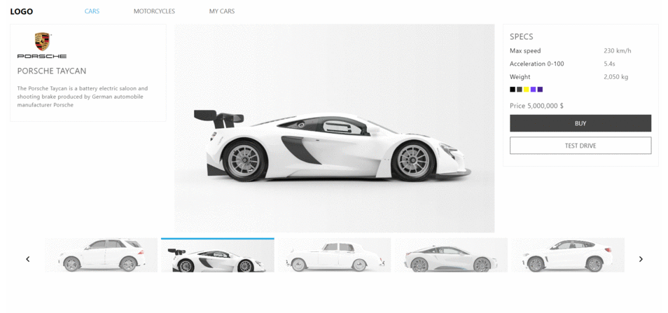

<h1 align="center">Car Showcase Slider</h1>

Welcome to the Car Slider Project, where you can effortlessly browse through a curated selection of cars.It includes several useful utilities.

## Requirements

- [Node > v16](https://nodejs.org/en/)
- [Yarn](https://yarnpkg.com/getting-started/install) / [npm](https://docs.npmjs.com/cli/v10/commands/npm-install)

_A basic understanding of modern web development workflows. If you're unfamiliar with these, React might not be suitable for you at this stage._

## About The Project



Explore the ultimate collection of luxury and performance cars with our Car Showcase Slider. Swipe through stunning images and detailed specifications of each model, including max speed, acceleration, weight, price, and more.This interactive slider provides an immersive experience for users to compare and admire the finest cars on the market.

### Built With

This project was built with the following technologies:

- [React](https://react.dev/)
- [Typescript](https://www.typescriptlang.org/)

## Getting Started

To get a local copy up and running follow these simple example steps.

### Installation

Please follow the following steps for successful installation:

1. **Clone the Repository:** Get started by cloning the repository to your local machine.

   ```
   https://github.com/Ruminatesoftware/CarSlider.git
   ```

2. **Install Packages:** Navigate to the directory and install the required yarn packages by executing the following command in your terminal:

   ```sh
   yarn install
   ```

3. **Run the Project:** Finally, enter the following command in your terminal to start your server:

   ```sh
   yarn start
   ```

   Now, your application should be successfully up and running!

## Features

This setup includes some utilities and examples to use as a foundation.

1. **Image Slider:** Smooth transition effects between images.

2. **Car Information Display:** Display car details such as max speed, acceleration, weight, price, logo, car model name, and description.

3. **Responsive Design:** Ensure the slider is fully responsive and works seamlessly on all devices (desktops, tablets, and smartphones).

## Contributing

Contributions are what make the open source community such an amazing place to learn, inspire, and create. Any contributions you make are **greatly appreciated**.

If you have a suggestion that would make this better, please fork the repo and create a pull request. You can also simply open an issue with the tag &quot;enhancement&quot;.
Don&#39;t forget to give the project a star! Thanks again!

1. Fork the Project
2. Create your Feature Branch (`git checkout -b feature/AmazingFeature`)
3. Commit your Changes (`git commit -m "Add some AmazingFeature"`)
4. Push to the Branch (`git push origin feature/AmazingFeature`)
5. Open a Pull Request

## License

Distributed under the [MIT license](LICENSE).

## Contact

If you have any questions or suggestions, feel free to reach out to us:

- Raise an issue on the repository: [GitHub Repository](https://github.com/Ruminatesoftware?tab=repositories)

## Acknowledgments

A special thanks to the following for their contributions, support and inspiration:

- [Ruminate Software](https://ruminate.gohero.us/)
